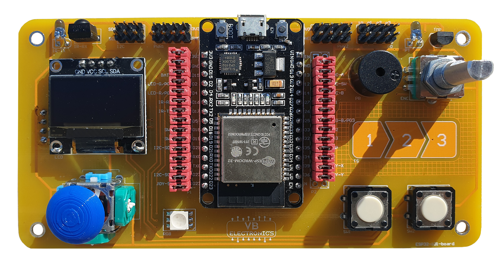
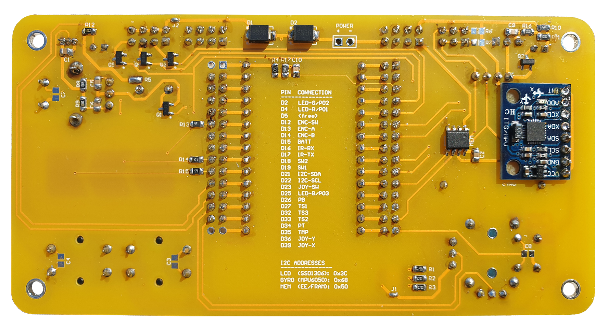

# Информация за развойната платка

## Здравейте!

Тук ще намерите информация  за развойна платка  **ESP32-101-board** базирана на съвременния и широко използван микронтролер ESP32  на фирмата [Espressif](https://www.espressif.com/en/products/socs/esp32). Това е широко популярен контролер в сферата на DIY и IoT проектите. Двуядрен микропроцесор със WiFi и Bluetooth LE 5.0 функционалности позволяващи по-голяма гъвкавост при комуникациите с други устройства в съвременния свят. 

Широкото му приложение в сферата на любителите се дължи на това, че този микроконтролер може да се програмира чрез вече познатата на много хора среда за програмиране Arduino IDE само с [добавянто на един допълнителен  Add-on](ide-install.md). 

Поради това че Arduino IDE не е native средата за програмиране на контролера има много подводни камъни на, които човек може да попадне. Ето защо ние от VB-tronics разработихме развойна платка с помощта на която да се разгледат и опишат, с нагледни примери, използването на повечето функционалности на този контролер чрез Ардуино средата. Разбира се, за да се използват повечето възножностите на контрелара е нужна и периферия, ето тук идва и ползата на **ESP32-101-board** развойна платка "*аут ъф да бокс*", без нужда от бредборд и досадни кабели. 
{ loading=lazy }
{ loading=lazy }

## Board-101

**ESP32-101-board** е платка, състояща се от микронтролер и редица периферни модули, свързани към него. Използваният контролер е ***ESP32*** под формата на ***30 pin***-ов модул.

=== "Периферия"

    !!! info "Периферия"
    
        - Бутони – 2 броя
        - Ротационен енкодер + бутон на остта
        - RGB-светодиод
        - Транзисторни цифрови изходи – 3 броя
        - Аналогов джойстик (2 оси) + бутон
        - Графичен OLED дисплей (128x64 пиксела, едноцветен)
        - Температурен сензор
        - Фотодиод
        - Инфрачервен светодиод
        - Инфрачервен приемник с демодулатор (38kHz)
        - Пиезо-зумер
        - Сензори за допир – 3 броя
        - Жироскоп/акселерометър (3 оси) [MPU6050](https://images.app.goo.gl/kfj9bCzdWzKArAfD6) 
        - Допълнителна (външна) EEPROM памет (опция)
=== "Микроконтролер"

    !!! info "Характеристики"
    
        - 32-битов микропроцесор, 1 или 2 ядра, до 240MHz
    
        - 520КB SRAM, 4MB flash
    
        - 802.11 b/g/n WiFi (2.4GHz)
    
        - Bluetooth v4.2 Classic, BLE
    
        - 34 програмируеми входо-изхода
    
        - 12-битов аналогово-цифров преобразувателен модул (до 18 канала)
    
        - 8-битов цифрово-аналогов преобразувател (2 канала)
    
        - Капацитивни входове за сензори на допир (10 канала)
    
        - **SPI**: [Serial Peripheral Interface](<https://en.wikipedia.org/wiki/Serial_Peripheral_Interface>) 4 интерфейса
    
        - **I2S**: [Inter-IC Sound](https://en.wikipedia.org/wiki/I%C2%B2S) (2 интерфейса)
    
        - **I2C**: [Inter-Integrated Circuit](https://en.wikipedia.org/wiki/I%C2%B2C) (2 интерфейса)
    
        - **UART**: [Universal asynchronous receiver-transmitter](https://en.wikipedia.org/wiki/Universal_asynchronous_receiver-transmitter) (3 интерфейса, един от които през вграден USB преобразувател)
    
        - **PWM**: [Pulse-width modulation](https://en.wikipedia.org/wiki/Pulse-width_modulation) (широчинно-импулсна модулация *ШИМ*, 16 канала)
    
        - Вграден датчик на Хол ([сензор за магнитно поле](https://en.wikipedia.org/wiki/Hall_effect_sensor))
    
        - **3.3V** работно напрежение

