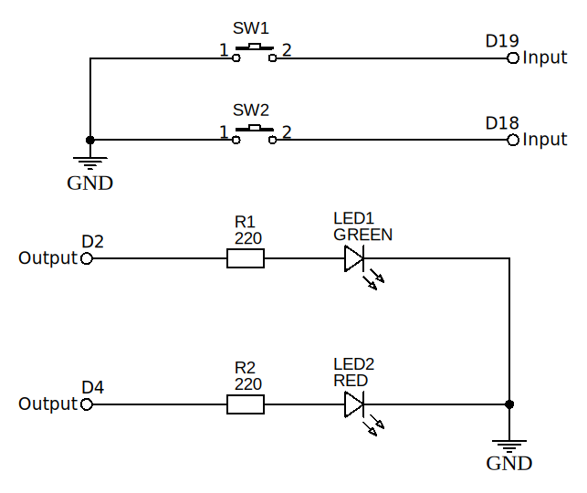

=== "Примерен код"
    ```c++
    /*
      В този пример бутон SW1 управлява червения светодиод,
      а бутон SW2 управлява зеления светодиод.

      Двата бутона (SW1 и SW2) са свързани съответно към пинове D19 и D18.
      Двата светодиода (LED-R и LED-G) са свързани съответно към пинове D4 и D2.
    */

    // константи, описващи използваните пинове
    const int SW1_pin = 19;
    const int SW2_pin = 18;
    const int LEDR_pin = 4;
    const int LEDG_pin = 2;

    // променливи, използвани при четенето на бутонтие
    int SW1_state;
    int SW2_state;

    void setup() {
       // настройване на пиновете на бутоните като "входове"
      pinMode(SW1_pin, INPUT_PULLUP);
      pinMode(SW2_pin, INPUT_PULLUP);

      // настройване на пиновете на светодиодите като "изходи"
      pinMode(LEDR_pin, OUTPUT);
      pinMode(LEDG_pin, OUTPUT);
    }

    void loop() {
      // прочитане на състояниета на бутоните (0/LOW при натиснат, 1/HIGH при отпуснат):
      SW1_state = digitalRead(SW1_pin);
      SW2_state = digitalRead(SW2_pin);

      // проверка за натиснати бутони:
      if (SW1_state == LOW) {
        // включване на червения светодиод:
        digitalWrite(LEDR_pin, HIGH);
      } else {
        // изключване на червения светодиод
        digitalWrite(LEDR_pin, LOW);
      }

      if (SW2_state == LOW) {
        // включване на зеления светодиод:
        digitalWrite(LEDG_pin, HIGH);
      } else {
        // изключване на зеления светодиод
        digitalWrite(LEDG_pin, LOW);
      }
    }
    ```
=== "Принципна схема на свързване"
 